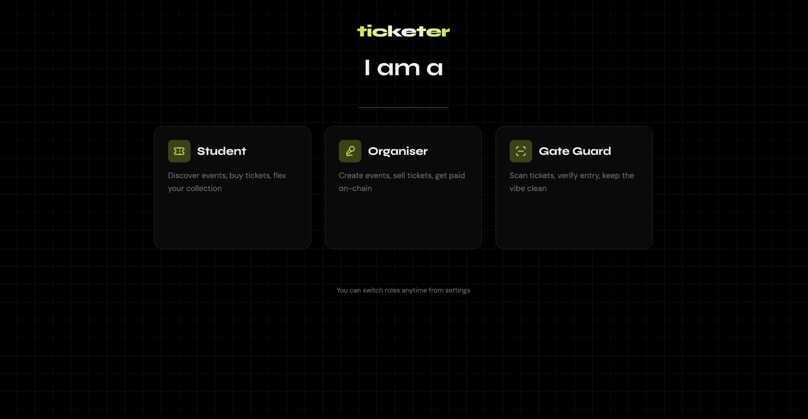
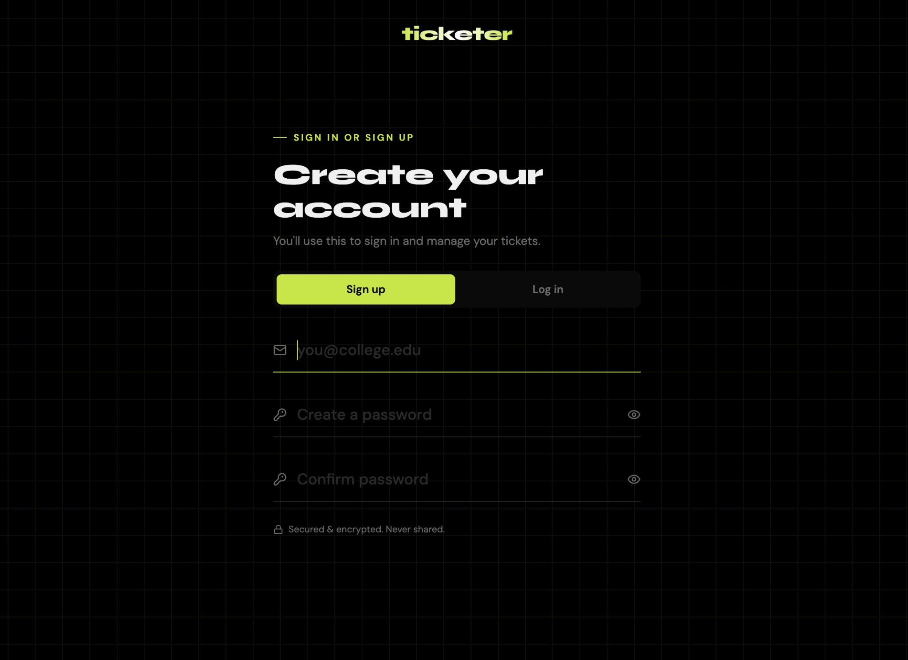
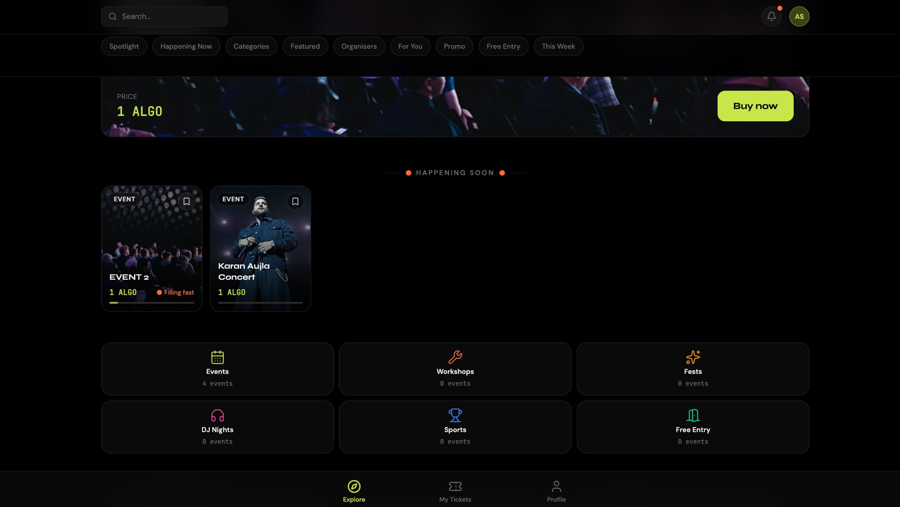
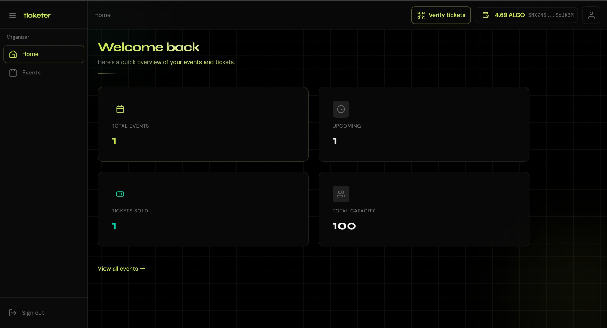
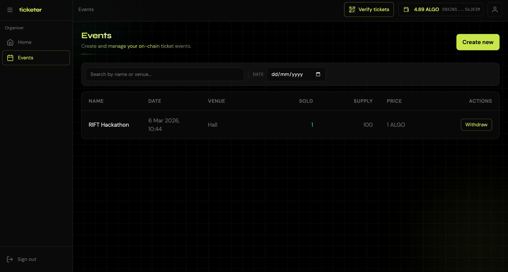
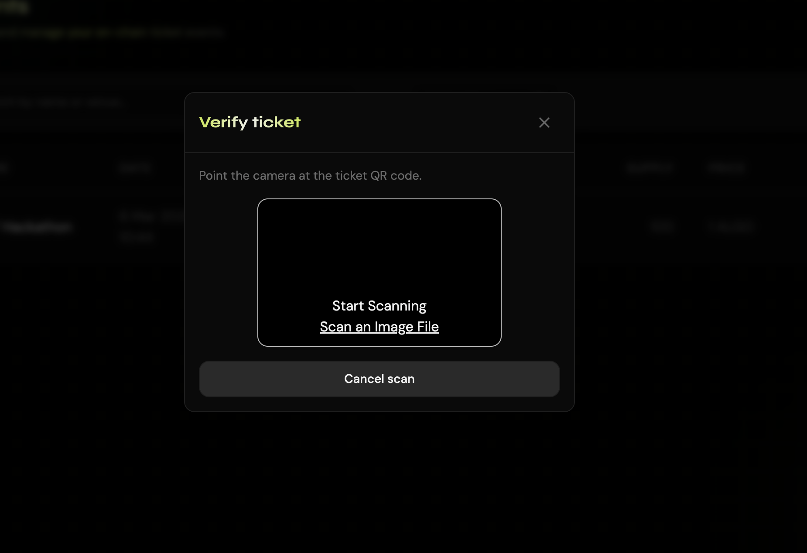
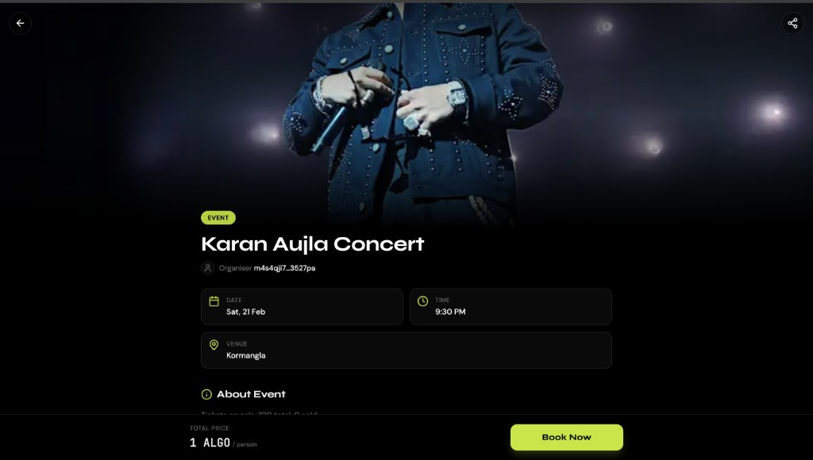

# Ticketer — Token-Based Event Ticketing

---

## Project title and description

**Ticketer** is a token-based event ticketing system where tickets are represented as **Algorand NFTs** (ARC-3). Organizers create events (details, ticket supply, price); students purchase tickets with their Algorand wallet; organizers or gate keepers verify ticket ownership at the entrance via QR code or ticket ID. The system prevents ticket fraud and enables transparent, on-chain ownership with optional transfer/resale.

**Project 5: Token-Based Event Ticketing**  
- **Difficulty:** Beginner  
- **Estimated time:** 12–14 hours  

**What we built:**
- Event creation interface for organizers (event details, ticket supply, price)
- Ticket purchase page with wallet integration
- Ticket verification system (QR code scanner or address/ticket ID checker)
- User dashboard showing owned tickets
- Optional: ticket transfer/resale via smart contract

**Technical components:**
- Frontend: React with QR code support
- Algorand SDK for ASA creation and transfers
- NFT minting for unique tickets (ARC-3)
- Mobile-responsive design for ticket verification

**Learning outcomes:** Creating and managing Algorand Standard Assets (ASAs), understanding NFT standards on Algorand, implementing token-gating (access control), building verification systems.

**Real-world application:** Prevents counterfeit tickets for college fests, concerts, and workshops while enabling transparent secondary markets.

---

## Problem statement selected (or description of your original idea)

**Problem statement: PS4_Algorand_Web3**

*(Paste or attach the exact problem statement here when you have it.)*

**Summary:** Create an event ticketing system where tickets are Algorand NFTs or fungible tokens. Students can purchase tickets for campus events, and organizers can verify ticket ownership at the entrance. This prevents ticket fraud and enables secondary market trading. Real-world application: prevents counterfeit tickets for college fests, concerts, and workshops while enabling transparent secondary markets.

---

## Live demo URL

**Live demo:** https://ticketerr.vercel.app

---

## LinkedIn demo video URL

**LinkedIn demo video:** https://www.linkedin.com/posts/nishchay-bhatia_team-vod-rift-activity-7430437116611862528-kXtk?utm_source=share&utm_medium=member_desktop&rcm=ACoAAESm_jgBSzIH7rOg7mJj0-PITKFqVqyMlQM

---

## App ID (Testnet) and Explorer Link for Algokit

- **App ID (Testnet):** **1067**
- **App Explorer:** https://testnet.explorer.perawallet.app/address/IN7MAEHX3NGDS7IPERKW3LXV5CE3CX45YYB2KU424NQ3VHYZABUMDL2J7Y

## Architecture overview — smart contract + frontend interaction

**Smart contract (Algorand):**  
One deployed app per event. Global state: organizer address, event name/date/venue, ticket price, supply, tickets sold. Local state per user: owned ticket NFT, pending mint, used flag, optional listing. Flow: organizer creates event → student pays and calls `mintTicket` → receives NFT via `claimTicket` → gate/organizer calls `verify` with ticket ID.

**Frontend (React):**  
Landing with role selection (Student / Organiser / Gate Guard) → Auth (login/signup with wallet) → Role-specific dashboards. Students browse events, buy tickets (wallet + API), view My Tickets and Profile. Organisers create events and verify tickets (QR or ticket ID). Gate verifies tickets at entrance.

**Interaction:**  
Frontend uses Algorand SDK and typed app client (AlgoKit Utils) to deploy event apps, mint ticket NFTs, and verify ownership. Backend API handles auth (JWT), profile (GET /api/me), and event metadata; ownership and verification are on-chain.

---

## Tech stack

- **AlgoKit:** AlgoKit CLI (bootstrap, build, deploy, localnet)
- **Smart contract language:** Algorand TypeScript (Puya) — compiles to TEAL
- **Frontend:** React, Vite, Tailwind CSS, daisyUI, @txnlab/use-wallet-react (Pera, Defly)
- **Backend:** Node.js, Express, JWT auth, Prisma, Neon PostgreSQL
- **Standards:** Algorand Standard Assets (ASAs), ARC-3 for ticket NFTs

---

## Installation & setup instructions

### Prerequisites

- Node.js 18+
- [AlgoKit CLI](https://github.com/algorandfoundation/algokit-cli#install) 2.5+
- Docker (for LocalNet)
- Puya compiler 4.4.4+ (for smart contracts)

### Setup

1. **Clone** the repo and `cd Ticketer`.
2. **Bootstrap:** Run `algokit project bootstrap all` (installs deps, prepares `.env`).
3. **LocalNet (optional):** From `projects/ticketer-contracts` run `algokit generate env-file -a target_network localnet`, then `algokit localnet start`.
4. **Build:** `algokit project run build` (compiles contracts and frontend, links app clients).
5. **Backend:**  
   `cd projects/ticketer-api` → `npm install` → `npx prisma generate` → `npx prisma db push`  
   (set `DATABASE_URL` and `DIRECT_URL` in `.env`, e.g. Neon). Then `npm run dev` → API at **http://localhost:3001**.
6. **Frontend:**  
   `cd projects/ticketer-frontend` → `npm install` → `npm run dev` → app at **http://localhost:5173**. Set `VITE_API_URL` if your API URL differs.

After pulling updates with new dependencies, run `algokit project bootstrap all` again.

---

## Usage guide with screenshots

1. **Landing & role** — Open the app; choose **Student**, **Organiser**, or **Gate Guard**.
2. **Auth** — **Sign up** (connect wallet, then email/password, name, interests) or **Sign in** (wallet + email/password). Wallet required for signup.
3. **Student** — Browse events → open event → purchase ticket (wallet signs; NFT minted) → view **My Tickets** and **Profile** (wallet address, ALGO balance, name, email).
4. **Organiser** — Create events (name, date, venue, supply, price); use **Verify tickets** to scan QR or paste ticket ID.
5. **Gate** — Use the verify flow to check tickets at the entrance.

### Screenshots

**1. Role selection (Landing)** — Choose Student, Organiser, or Gate Guard. You can switch roles anytime from settings.

**2. Create your account (Sign up)** — Sign up with email and password (e.g. you@college.edu). Secured & encrypted. You can switch to **Log in** if you already have an account.

**3. Explore events (Student)** — Browse featured events, “Happening Soon,” and categories. Prices in ALGO; buy from event cards or open an event to book.

**4. Organiser dashboard (Home)** — Overview: total events, upcoming, tickets sold, total capacity. Quick link to all events.

**5. Organiser events** — Create and manage on-chain events. Table shows name, date, venue, sold/supply, price (ALGO), and actions (e.g. Withdraw).

**6. Verify ticket (QR)** — Gate/organiser flow: point camera at the ticket QR code or scan an image file to verify entry.

**7. Event details & book** — Event page with banner, details (date, time, venue), organiser address, and **Book Now** (price in ALGO).

---

## Known limitations

- One smart contract app per event; creation and deployment are per event.
- Wallet required for signup and ticket purchase; no custodial option.
- Event list and user profiles are off-chain (API/DB); only ownership and verification are on-chain.
- Default deployment targets Testnet; MainNet requires config and funding.
- QR content for verification must match the format expected by the app.

---

## References

- [AlgoKit CLI](https://github.com/algorandfoundation/algokit-cli)
- [Algorand TypeScript (Puya)](https://github.com/algorandfoundation/puya-ts/)
- [AlgoKit Utils (TypeScript)](https://github.com/algorandfoundation/algokit-utils-ts)
- [use-wallet (Algorand)](https://github.com/txnlab/use-wallet)
- [ARC-3 (NFT metadata)](https://github.com/algorandfoundation/ARCs/blob/main/ARCs/arc-0003.md)
